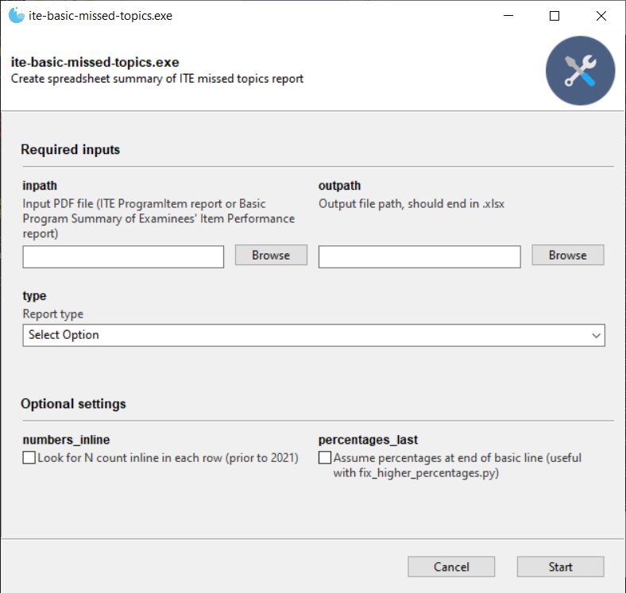
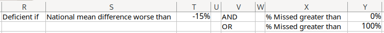
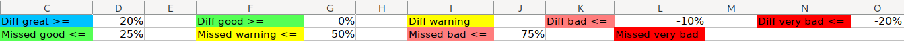
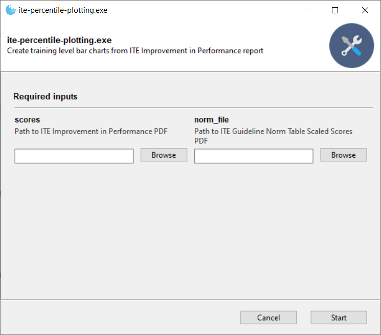

# Missed topic summaries for ITE and Basic exams

Produces a spreadsheet summarizing the aggregate results for AGCME's ITE
(ProgramItem report) or Basic (Program Summary of Examinees' Item Performance
report) exams.



By default, `acgme_missed_topics` will open a GUI built by
[Gooey](https://github.com/chriskiehl/Gooey).
Disable by setting the `GUI_DISABLE` environment variable.

```bash
$ GUI_DISABLE=1 ite-basic-missed-topics -t $TYPE infile.pdf outfile.xlsx
```

`$TYPE` is one of `basic` or `ite`.

## Installation

To install globally, build the wheel using `poetry build`, and install it using `pip`.

The following binaries are provided when installing, corresponding to the
`main` functions of their corresponding scripts:

- `ite-basic-missed-topics`: `missed_topics.py`
- `ite-percentile-plotting`: `percentile_plotting.py`

## Criteria and configuration

The key at the top isn't particularly readable, but it's what fuels the
coloring and the marks in the Deficient columns.

If you expand the columns a bit, it shows that one is marked deficient if either:

1. the difference from the national mean is greater than 15% and the % missed is greater than 0%
2. the % missed is 100%



Similarly, the numbers to the right of each color control the highlighting
cutoffs for the corresponding category. For example, the "Difference" section
is marked as green if it's between 0 and 20%, blue if 20% or greater, and light
red if between -10% and -20%.



All of the numbers at the top of the spreadsheet can be changed, and the
highlighting and "Deficient Area" marks should update automatically!


## Percentile plotting

Produces training level bar charts from ITE Improvement in Performance report
and Guideline Norm Table.



```bash
$ GUI_DISABLE=1 ite-percentile-plotting ITE2021_Improvement_in_Performance_ID.pdf
2021-ITE-Guideline-Norm-Table_Cleaned.pdf
```

